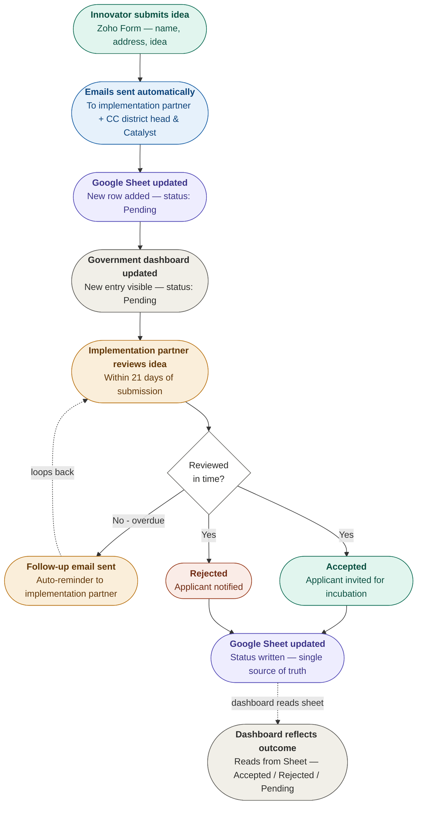

# RAMP Idea Submission & Review Workflow
### IIT Mandi Catalyst — Consolidated System Design & Operating Guide
**Zoho Forms · Google Apps Script · Google Sheets · GitHub Pages**

*Version 1.0 — June 2026*

---

## Contents

1. [System Overview](#1-system-overview)
2. [End-to-End Workflow](#2-end-to-end-workflow)
3. [Data Flow & the Single Source of Truth](#3-data-flow--the-single-source-of-truth)
4. [Zoho Form Fields](#4-zoho-form-fields)
5. [Google Sheet Structure](#5-google-sheet-structure)
6. [Email Review System](#6-email-review-system)
7. [The 21-Day Review Rule](#7-the-21-day-review-rule)
8. [Government Dashboard](#8-government-dashboard)
9. [Key Operating Notes & Constraints](#9-key-operating-notes--constraints)

---

## 1. System Overview

This document consolidates the full design of the RAMP idea-submission and review workflow as finalised so far. It covers the public submission path, the email-based review process for implementation partners, the data architecture, and the operating rules that keep everything consistent.

The guiding principle of the whole system is simple:

> **The Google Sheet is the single source of truth.** Every status change is written into the Sheet first. The public website only reads from it — it never writes back. If it is in the Sheet, it is true; the website is just a live reflection of the Sheet.

### The technology stack

The entire system runs on free, serverless tooling. There is no backend server to maintain.

| Component | Role in the system |
|---|---|
| **Zoho Forms** | Public-facing form where innovators submit their idea. Captures personal details, idea description, startup stage, sector, prior research, team status, and support needed. Full field list in Section 4. |
| **Google Apps Script** | The free "glue". Receives the form webhook, writes to the Sheet, sends notification emails, scans replies, and runs the 21-day reminder. Runs in the cloud under the Catalyst Google account. |
| **Google Sheets** | Master database of every submission and its status. Single source of truth. |
| **Gmail** | Carries notification emails to implementation partners and receives their Reply-All responses, which the script reads. |
| **GitHub Pages** | Hosts the static public website and the government dashboard. Fetches the published Sheet CSV and displays it. |

---

## 2. End-to-End Workflow



*Figure 1 — End-to-end idea submission and review workflow*

In words, the journey of a single idea from submission to a recorded outcome on the dashboard:

1. **Innovator submits the form.** An innovator fills the Zoho Form with their personal details, district, implementation partner, idea title, description, startup stage, sector, and support needed (full field list in Section 4).
2. **Form fires a webhook.** On submit, Zoho sends the data to the Apps Script web-app URL.
3. **Script records and notifies.** Apps Script appends a new row to the Sheet (status = Pending) and sends a notification email.
4. **Email goes to the implementation partner.** The selected implementation partner is the To recipient; the district head and IIT Mandi Catalyst are CC'd.
5. **Dashboard reflects the new entry.** The government dashboard, reading the Sheet, immediately shows the submission as Pending.
6. **Implementation partner reviews within 21 days.** The partner responds using Reply All with a structured status line (Accept / Reject / Review).
7. **Script updates the Sheet.** Apps Script reads the reply, matches it by reference ID, and updates the status, reason, and response date.
8. **Applicant is informed.** On Accept or Reject, the script emails the applicant the outcome.
9. **Overdue reminder.** If a submission is still Pending after 21 days, the script automatically sends a follow-up reminder to the implementation partner.
10. **Dashboard reflects the outcome.** Because the status is now written in the Sheet, the dashboard reflects it on the next load — Accepted, Rejected, or Under review. The dashboard reads the Sheet; it is never updated directly.

---

## 3. Data Flow & the Single Source of Truth

Status reaches the Sheet through three paths. The website is never one of them — it is read-only.

### The three ways the Sheet gets updated

1. **Gmail reply (primary, automated).** The implementation partner replies to the notification email; Apps Script reads it and writes the status to the Sheet.
2. **Direct Sheet edit (manual fallback).** If a partner responds by phone or WhatsApp instead, Catalyst opens the Sheet and types the status directly.
3. **Zoho form submission (new rows).** Each new submission appends a fresh row with status = Pending.

### How the website reads it

The Sheet is published as a public CSV (File → Share → Publish to web → CSV). The dashboard JavaScript runs a `fetch()` on that URL, parses it (e.g. with PapaParse) and renders the table. It is a one-way read: the website has no ability to write back. When Catalyst updates the Sheet, anyone who loads the dashboard afterwards sees the new data automatically.

> **Rule:** Nothing writes to the website directly. All changes go into the Sheet first, and the website always reflects the current Sheet state.

### Keeping officials confident the data is current

A `last_updated` column is filled by Apps Script whenever it changes a status. The dashboard can surface this as, for example, "Last updated: 3 June 2026, 10:42am" so government officials know the snapshot is live.

---

## 4. Zoho Form Fields

The public form captures the following fields from every applicant. All of these are stored as columns in the Google Sheet.

**Personal details**

| Field | Notes |
|---|---|
| Name | Full name of the applicant |
| Phone | Mobile number |
| Email | Used for outcome notifications |
| Address | Village / town, district, state, PIN |
| Gender | Male / Female / Other |
| Date of birth | Used to calculate age |
| Age | Auto-calculated |

**Location & programme routing**

| Field | Notes |
|---|---|
| District | The applicant's district — used to route the email to the correct implementation partner |
| Institutes | Dropdown — selects the implementation partner for that district |
| Institutes name | Free-text fallback if the partner is not in the dropdown |

**Idea & startup details**

| Field | Notes |
|---|---|
| Idea title | Short name for the idea |
| Provide a short description of your idea | The core pitch |
| Current status of your startup / business | e.g. Idea Stage, Prototype, Revenue-generating |
| Which sector does your startup belong to | e.g. Tourism & Travel, Agri-Tech, Clean Energy |
| What is the current stage of your startup | e.g. I only have an idea, Prototype ready, Early revenue |

**Research & validation**

| Field | Notes |
|---|---|
| Have you done any research related to this idea? | Yes / No research yet |
| Have you tried making your product? | Yes / No |
| Have you made any sample or model of your product? | Yes / No |
| How did you do the testing of your product? | Free text |
| What feedback did you receive? | Free text |
| Is this commercialised? | Yes / No |
| Are you currently earning from this business? | Yes / No |

**Market & operations**

| Field | Notes |
|---|---|
| Who are your customers? | Free text |
| How do you sell your product / service? | Free text |
| How will you sell your product / service? | Free text |
| Do you have a team? | Yes / No |

**Support requested**

| Field | Notes |
|---|---|
| What support do you need right now? | Free text |
| What kind of support do you need from the RAMP Program? | Free text |
| Have you been part of any incubation earlier? | Yes / No |

---

## 5. Google Sheet Structure

The master sheet holds one row per submission. The first block of columns mirrors the Zoho form exactly (auto-populated by Apps Script from the webhook). The second block is filled by the review process.

**Auto-populated from the form**

| Column | Source |
|---|---|
| **ID** | Generated by Apps Script — e.g. `RAMP-2024-047`. The link between email and row. |
| **Added time** | Zoho submission timestamp. Drives the 21-day deadline. |
| **Name** | Form field |
| **Phone** | Form field |
| **Email** | Form field — used to send outcome notification |
| **Address** | Form field |
| **Gender** | Form field |
| **Date of birth** | Form field |
| **Age** | Form field |
| **District** | Form field — used to route to the correct implementation partner |
| **Implementation partner** | Derived from the Institutes dropdown |
| **Idea title** | Form field |
| **Idea description** | Form field |
| **Startup status** | Form field |
| **Sector** | Form field |
| **Startup stage** | Form field |
| **Prior research** | Form field |
| **Prototype made** | Form field |
| **Sample / model** | Form field |
| **Testing method** | Form field |
| **Feedback received** | Form field |
| **Commercialised** | Form field |
| **Currently earning** | Form field |
| **Customers** | Form field |
| **Sales method** | Form field |
| **Team** | Form field |
| **Support needed now** | Form field |
| **Support from RAMP** | Form field |
| **Prior incubation** | Form field |

**Filled by the review process**

| Column | Contents |
|---|---|
| **Status** | `Pending` / `Accepted` / `Rejected` / `Under review`. This is what the dashboard counts. |
| **Response date** | Auto-filled when the partner responds. |
| **Reason** | The partner's reason; passed to the applicant in the outcome email. |
| **Responded by** | Email address of the partner rep who replied. |
| **last_updated** | Timestamp set by Apps Script on any status change. |

---

## 6. Email Review System

Review is handled entirely over Gmail so implementation partners do not need any new login or tool. The notification email carries the reference ID and the reply instructions; partners respond with Reply All.

### 6.1 Recipients of the notification email

- **To:** the selected implementation partner (the incubation centre handling that district).
- **CC:** the district head and IIT Mandi Catalyst.

Because Catalyst is CC'd, the reply (sent via Reply All) reaches the Catalyst account, where Apps Script can read it.

### 6.2 The outgoing notification email

Sent automatically by Apps Script on form submission. The subject line carries the reference ID in brackets, which must be preserved in the reply.

```
Subject: [RAMP-2024-047] New idea submission — Mandi District
To: ITI Joginder Nagar (Implementation Partner)
CC: District Head (Mandi), IIT Mandi Catalyst

Dear ITI Joginder Nagar team,

A new idea has been submitted under the RAMP programme for your centre.

─── REFERENCE ───────────────────────────────────
Reference ID:        RAMP-2024-047
Submitted on:        01 June 2026
Review deadline:     22 June 2026 (21 days)

─── APPLICANT ───────────────────────────────────
Name:                Ravi Kumar
Phone:               98765 43210
Email:               ravi@example.com
Address:             Village Balichowki, Mandi, HP — 175021
Gender:              Male      Age: 24
District:            Mandi

─── IDEA ────────────────────────────────────────
Title:               E-waste recycling unit
Description:         Collecting discarded electronics from repair shops
                     and selling recovered components to resellers.
Sector:              Clean Energy / E-waste
Startup stage:       I only have an idea
Current status:      Idea Stage

─── RESEARCH & VALIDATION ───────────────────────
Prior research:      No research yet
Prototype made:      No
Sample / model:      No
Commercialised:      No
Currently earning:   No

─── MARKET ──────────────────────────────────────
Customers:           Local electronics repair shops
Sales method:        Direct outreach

─── TEAM & SUPPORT ──────────────────────────────
Has a team:          No
Support needed now:  Mentorship and market research
Support from RAMP:   Business model guidance, funding connections
Prior incubation:    No

─────────────────────────────────────────────────

Please review and respond within 21 days by clicking Reply All on this
email, following the instructions below.

Regards,
RAMP Programme — IIT Mandi Catalyst
```

### 6.3 Reply instructions (appended to every notification email)

Every notification email ends with the following block, telling the implementation partner exactly how to respond:

```
HOW TO RESPOND
Click Reply All and write your decision on the first line in this format:

STATUS: ACCEPT   — invite the applicant for incubation
STATUS: REJECT   — decline the application (reason required)
STATUS: REVIEW   — you need more time but have begun evaluating

On the next line, add a short reason:
REASON: Strong local market fit; will invite for Phase B visit.

IMPORTANT: Use Reply All, not Reply, so that IIT Mandi Catalyst and the
district head stay copied. A reply sent only to the implementation partner
will NOT be recorded.
```

### 6.4 What each status means

| Keyword | Recorded as | What the system does |
|---|---|---|
| `ACCEPT` | Accepted | Sends the applicant a congratulations email; logs reason and response date. |
| `REJECT` | Rejected | Sends the applicant a polite decline email (reason required); logs response date. |
| `REVIEW` | Under review | Pauses the 21-day reminder for a further 7–10 days; no applicant email yet. |

### 6.5 What a valid reply looks like

As long as the implementation partner uses Reply All and does not change the subject line, the script can always match the reply to the right row.

```
Subject: Re: [RAMP-2024-047] New idea submission — Mandi District

STATUS: ACCEPT
REASON: Good local market fit. Student has prior repair experience.
Will invite for Phase B visit at IIT Mandi.
```

### 6.6 What Apps Script looks for in the reply

- The subject line contains the reference ID, e.g. `RAMP-2024-047`.
- The body contains a line beginning `STATUS:` followed by ACCEPT, REJECT, or REVIEW (case-insensitive).
- An optional line beginning `REASON:` provides text passed to the applicant.

It then finds the matching row by ID and updates: Status, Response date, Reason, Responded by, and `last_updated`.

---

## 7. The 21-Day Review Rule

Every submission must receive a decision within 21 days of its submission date.

- The clock starts the moment the notification email is sent.
- A daily time-triggered Apps Script function scans the Sheet each morning for rows still marked Pending whose submission date is more than 21 days old.
- For each overdue row, it sends a reminder email to the implementation partner (Reply All recipients preserved).
- A `STATUS: REVIEW` reply pauses this reminder for a further 7–10 days, acknowledging that evaluation has begun.

On the dashboard, an overdue Pending item can be flagged as **Overdue** rather than simply Pending, making it easy for officials to spot which implementation partners are slow to respond.

---

## 8. Government Dashboard

The dashboard is a password-gated page on the same GitHub Pages site, for government officials. It reads the same published Sheet CSV and presents a live snapshot.

### What it shows, per centre

- Total ideas submitted.
- How many were accepted, rejected, and still pending.
- Which specific ideas were accepted (top accepted ideas).
- Average response time — days from submission to first decision.

Because the dashboard derives everything from the Status column of the Sheet, the moment a status changes in the Sheet, the dashboard reflects it on the next load. No separate data entry is ever needed.

---

## 9. Key Operating Notes & Constraints

- **One Gmail account.** Apps Script can only scan the inbox it runs under, so notification emails are sent from — and replied to — the Catalyst Google account. Implementation partners reply to that address, not their own. This is fine, as Catalyst maintains the system.
- **Preserve the subject line.** The reference ID in the subject is the link between email and Sheet row. Gmail keeps subject lines on replies by default, so matching is reliable as long as nobody edits it.
- **Reply All, always.** A plain Reply goes only to the implementation partner and will not be recorded. The instruction block stresses this in every email.
- **Sheet first, always.** The website is read-only. Every change is made in the Sheet (by script or by hand); the site mirrors it.
- **Cost.** The whole system is free within Google's normal usage limits and needs no hosting beyond GitHub Pages.

---

*End of workflow document — IIT Mandi Catalyst, RAMP Himachal Pradesh*
